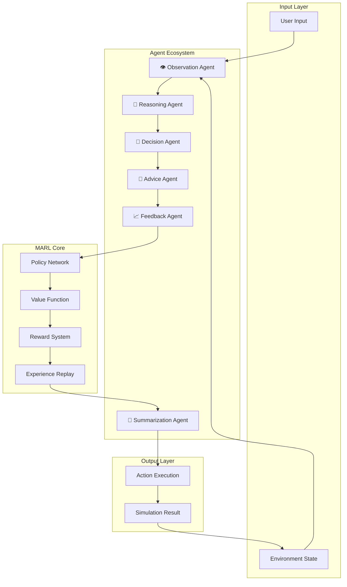
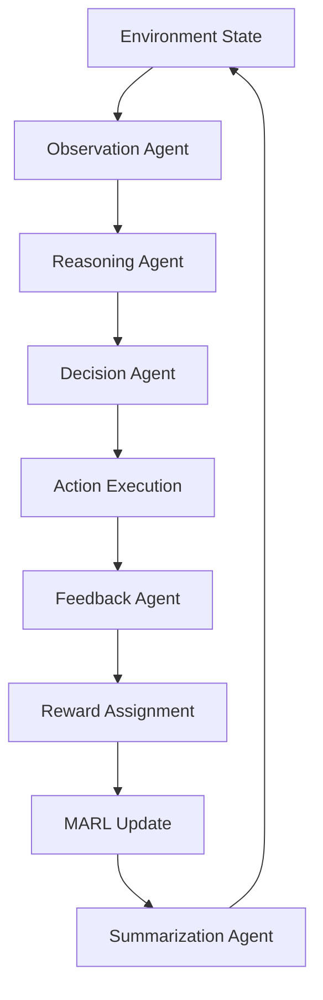

# 🤖 MARL LLM Simulation Agent

<div align="center">


### 🚀 Multi-Agent Reinforcement Learning powered LLM Simulation Framework

A modular AI ecosystem where specialized LLM agents collaborate, reason, observe, summarize, and optimize decisions using MARL principles.

---

</div>

<p align="center">
  
</p>

---

# 🌟 Project Overview

This project simulates an intelligent ecosystem of Large Language Model agents using **Multi-Agent Reinforcement Learning (MARL)** concepts.

Each AI agent is responsible for a specialized task:

* 🧠 Logical reasoning
* 👀 Environmental observation
* 🎯 Strategic decision making
* 💬 Advice generation
* 📝 Summarization
* 📈 Feedback analysis

The agents collaborate together in a shared simulation environment and continuously improve through iterative learning and feedback loops.

---

# 🧩 System Architecture


---

# ⚡ Key Features

## ✅ Multi-Agent Collaboration

Multiple specialized LLM agents communicate and cooperate intelligently.

## ✅ MARL-Based Learning

Agents improve through rewards, feedback, and reinforcement learning concepts.

## ✅ Modular Architecture

Easily extend the framework with:

* New agents
* Custom environments
* Different LLM providers
* Additional reward systems

## ✅ Dynamic Simulation

Supports iterative simulations with evolving environment states.

## ✅ Plug-and-Play LLM Support

Compatible with:

* OpenAI
* Groq
* Gemini
* Claude
* Ollama
* Local LLMs

---

# 🧠 Agent Ecosystem

| Agent                    | Responsibility                 |
| ------------------------ | ------------------------------ |
| `base_agent.py`          | Core agent framework           |
| `reasoning_agent.py`     | Logical reasoning and analysis |
| `decision_agent.py`      | Strategic decision making      |
| `observation_agent.py`   | Environment observation        |
| `feedback_agent.py`      | Reward and evaluation analysis |
| `advice_agent.py`        | Recommendation generation      |
| `summarization_agent.py` | Final response summarization   |

---

# 📂 Project Structure

```bash
MARL_LLM_SIMULATION_AGENT/
│
├── agents/
│   ├── advice_agent.py
│   ├── base_agent.py
│   ├── decision_agent.py
│   ├── feedback_agent.py
│   ├── observation_agent.py
│   ├── reasoning_agent.py
│   └── summarization_agent.py
│
├── config/
├── marl/
├── simulation/
├── results/
│
├── main.py
├── run_marl.py
├── run_with_marl.py
├── run_evaluation.py
│
├── requirements.txt
└── README.md
```

---

# 🔄 MARL Workflow



---

# 🏗️ Tech Stack

| Technology             | Purpose                       |
| ---------------------- | ----------------------------- |
| Python                 | Core Development              |
| LLM APIs               | Intelligence Layer            |
| MARL Concepts          | Agent Collaboration           |
| Async Processing       | Efficient Agent Communication |
| Reinforcement Learning | Adaptive Optimization         |

---

# 🚀 Installation

## 1️⃣ Clone the Repository

```bash
git clone https://github.com/your-username/MARL_LLM_SIMULATION_AGENT.git

cd MARL_LLM_SIMULATION_AGENT
```

---

## 2️⃣ Create Virtual Environment

### Windows

```bash
python -m venv venv

venv\Scripts\activate
```

### Linux / Mac

```bash
python3 -m venv venv

source venv/bin/activate
```

---

## 3️⃣ Install Dependencies

```bash
pip install -r requirements.txt
```

---

# 🔑 Environment Variables

Create a `.env` file in the root directory:

```env
OPENAI_API_KEY=your_key_here

GROQ_API_KEY=your_key_here

GOOGLE_API_KEY=your_key_here
```

---

# ▶️ Running the Project

## Run Standard Simulation

```bash
python main.py
```

---

## Run MARL Simulation

```bash
python run_marl.py
```

---

## Run Advanced MARL Workflow

```bash
python run_with_marl.py
```

---

## Run Evaluation

```bash
python run_evaluation.py
```

---

# 📊 Example Output

```bash
[Observation Agent]
Environment scanned successfully.

[Reasoning Agent]
Analyzing possible actions...

[Decision Agent]
Selected optimal strategy.

[Feedback Agent]
Reward Score: +0.87

[Summarization Agent]
Simulation cycle completed successfully.
```

---

# 🎯 MARL Concepts Used

## 🔹 Cooperative Learning

Agents collaborate to maximize collective rewards.

## 🔹 Reward Optimization

Dynamic feedback improves future strategic decisions.

## 🔹 State Transition Modeling

The environment evolves based on agent interactions.

## 🔹 Policy Improvement

Agents refine behavior using reinforcement signals.

---

# 📈 Future Improvements

* [ ] Real-time simulation dashboard
* [ ] Memory-enabled autonomous agents
* [ ] Vector database integration
* [ ] RAG-powered reasoning systems
* [ ] LangGraph orchestration
* [ ] Distributed multi-agent execution
* [ ] Self-improving autonomous AI networks
* [ ] Live visualization system

---

## Reinforcement Learning Cycle

<p align="center">
  
</p>

---

# 🧪 Research Applications

This framework can be used for:

* Autonomous AI ecosystems
* AI collaboration frameworks
* Strategic simulations
* Decision intelligence systems
* Reinforcement learning experiments
* Multi-agent reasoning systems

---

# 🤝 Contributing

Contributions are welcome!

## Steps to Contribute

```bash
Fork the repository

Create a new feature branch

Commit your changes

Push to your branch

Open a Pull Request
```

---

# 📜 License

This project is licensed under the MIT License.

---

# 👨‍💻 Author

## Abhinav Singh

---

# ⭐ Support

If you like this project:

⭐ Star the repository
🍴 Fork it
🧠 Share ideas and improvements

---

<div align="center">

</div>
